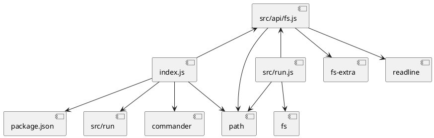

# 依赖关系

# 代码说明
[./index.js](./index.js)	命令行处理 
[./src/run.js](./src/run.js)	入口文件 
## [./src/api](./src/api)
[├───fs.js](./src/api/fs.js)	通用文件系统能力 
[└───string.js](./src/api/string.js)	字符串处理 
  create by [gen-structure@liquid](https://github.com/ljquan/gen-structure.git)