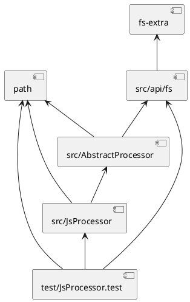
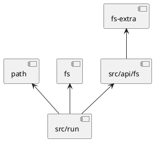
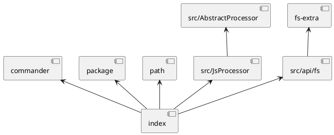
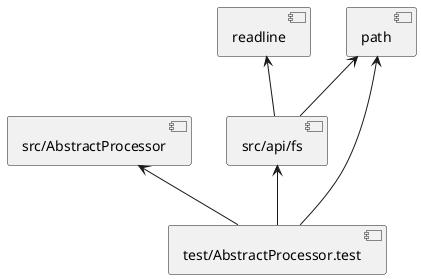

# 依赖关系

# 代码说明
[index.js](index.js)	命令行处理 
# [src](src)
[├──AbstractProcessor.js](src/AbstractProcessor.js)	入口文件 
[├──JsProcessor.js](src/JsProcessor.js)	入口文件 
[├──run.js](src/run.js)	入口文件 
## [api](src/api)
[├───fs.js](src/api/fs.js)	通用文件系统能力 
[└───string.js](src/api/string.js)	字符串处理 
# [test](test)
[├──AbstractProcessor.test.js](test/AbstractProcessor.test.js)	 
[├──JsProcessor.test.js](test/JsProcessor.test.js)	 
## [fixture](test/fixture)
[├───class copy.ts](test/fixture/class copy.ts)	1、注释与定义相邻的情况 
[├───class.ts](test/fixture/class.ts)	1、注释与定义相邻的情况 
[├───parseFunction.ts](test/fixture/parseFunction.ts)	 
[├───parseKeyWord.ts](test/fixture/parseKeyWord.ts)	关键词：'if', 'switch', 'with', 'catch', 'for', 'while', 'void'等不被误判 
[└───parseObject.ts](test/fixture/parseObject.ts)	文件注释 
  create by [gen-structure@liquid](https://github.com/ljquan/gen-structure.git)