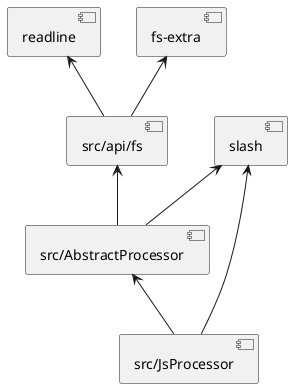
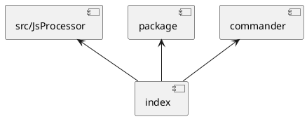
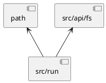

# 依赖关系

# 代码说明
[index.js](index.js)	命令行处理 
# [src](src)
[├AbstractProcessor.js](src/AbstractProcessor.js)	// 上次结束的位置为本次开始位置 
[├JsProcessor.js](src/JsProcessor.js)	把引用链长的排在前面 
[├run.js](src/run.js)	段单行注释减一 
## [└api](src/api)
[├─fs.js](src/api/fs.js)	通用文件系统能力 
[└─string.js](src/api/string.js)	字符串处理 
  create by [gen-structure@liquid](https://github.com/ljquan/gen-structure.git)